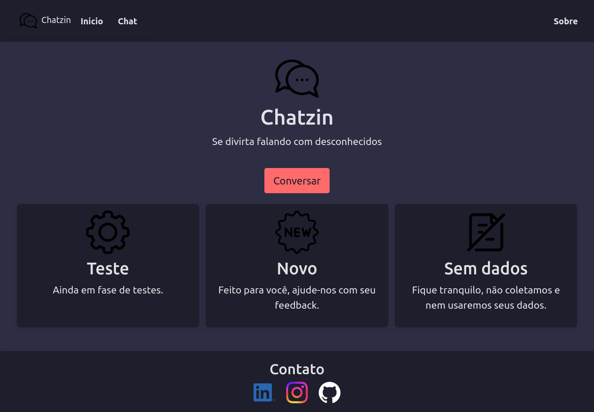

# Chatzin

Este é um simples aplicativo de chat online construído com Flask e Socket.IO. Permite que múltiplos usuários se conectem e conversem em tempo real através de uma interface web.

## Screenshots

## Stack utilizada

**Front-end:** TailwindCSS, JavaScript

**Back-end:** Python, Flask

## Funcionalidades

    Interface Simples: Interface web simples e intuitiva.
    Chat em Tempo Real: Mensagens são enviadas e recebidas instantaneamente.
    Múltiplos Usuários: Vários usuários podem se conectar ao chat ao mesmo tempo.
    Sala de Chat: Os usuários podem enviar mensagens para todos na sala.
    Histórico de Mensagens: O chat mantém um histórico das mensagens recentes.

## Pré-requisitos

### Certifique-se de ter o seguinte instalado antes de começar:
  
     Python 3

## Instalação e Uso

1. Acesse o chat:

    - https://chatzin-dztl.onrender.com/

2. Ou siga os seguintes passos:

- Clone o repositório:

        git clone https://github.com/Louiexz/Site-Flask.git
        cd Site-Flask
 
 - Instale as dependências:

        pip install -r requirements.txt

 - Execute o aplicativo:

        gunicorn -k gevent -w 1 -b 0.0.0.0:8000 app:app

 - Acesse o chat:

        Abra um navegador e vá para http://localhost:8000

## Estrutura do Projeto

    Site-Flask/
    │
    ├── app.py                  # Arquivo principal do aplicativo
    ├── routes/                 # Diretório contendo routes Flask
    │   ├── home.py              # Route da página inicial
    │   ├── chat.py              # Route da página chat
    │   └── about.py             # Route da página sobre
    ├── static/                 # Diretório contendo arquivos estáticos (CSS, IMG, JS)
    │   ├── css/                 # Diretório contendo estilos css
    │   ├── img/                 # Diretório contendo imagens
    |   |   └── icon/             # Diretório contendo os ícones
    │   ├── Pages/               # Diretório contendo diretórios das páginas
    |   |   └── Chat/             # Diretório arquivos css e scripts js página chat
    |   |       └── css/           # Diretório css da página
    |   |       └── js/            # Diretório js da página
    │   └── sound/               # Diretório contendo sons
    ├── templates/              # Diretório contendo templates HTML
    │   ├── base.html            # Template base para as páginas
    │   ├── index.html           # Página inicial
    │   ├── chat.html            # Página do chat
    |   └── about.html           # Página sobre nós
    └── requirements.txt        # Arquivo contendo as dependências do Python

## Contribuições
[@Louiexz](https://www.github.com/Louiexz) - Autor e Desenvolvedor do site 

Contribuições são bem-vindas! Sinta-se à vontade para abrir issues ou pull requests.
