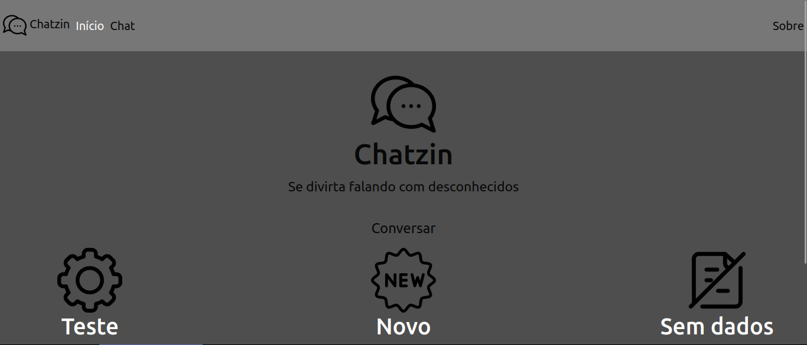

# Chatzin

Este é um simples aplicativo de chat online construído com Flask e Socket.IO. Permite que múltiplos usuários se conectem e conversem em tempo real através de uma interface web.

## Funcionalidades

    Chat em Tempo Real: Mensagens são enviadas e recebidas instantaneamente sem a necessidade de atualizar a página.
    Múltiplos Usuários: Vários usuários podem se conectar ao chat ao mesmo tempo.
    Sala de Chat: Os usuários podem enviar mensagens para todos na sala.
    Histórico de Mensagens: O chat mantém um histórico das mensagens recentes.
    Interface Simples: Interface web simples e intuitiva.

## Pré-requisitos

### Certifique-se de ter o seguinte instalado antes de começar:
  
     Python 3
     Flask
     Flask-SocketIO

## Instalação e Uso

1. Acesse o chat:

    - https://site-flask-lake.vercel.app/

2. Ou siga os seguintes passos:

- Clone o repositório:

        git clone https://github.com/Louiexz/Site-Flask.git
        cd Site-Flask
 
 - Instale as dependências:

        pip install -r requirements.txt

 - Para funcionar:

    - Em app.py, remova "api." das importações

 - Execute o aplicativo:

        python api/app.py

 5. Acesse o chat:

    - Abra um navegador e vá para http://localhost:5000

## Estrutura do Projeto

    Site-Flask/
    │
    ├── app.py                  # Arquivo principal do aplicativo
    ├── routes/                 # Diretório contendo routes Flask
    │   ├── home.py              # Route da página inicial
    │   ├── chat.py              # Route da página chat
    │   └── about.py             # Route da página sobre
    ├── templates/              # Diretório contendo templates HTML
    │   ├── index.html           # Template base para as páginas
    │   ├── chat.html            # Página do chat
    |   └── about.html           # Sobre nós da página
    ├── static/                 # Diretório contendo arquivos estáticos (CSS, IMG, JS)
    │   ├── img/                # Diretório contendo as imagens utilizadas
    │   ├── js/script.js        # Arquivo JavaScript para interação com Socket.IO
    │   └── css/                # Diretório contendo estilos css
    │    ├── style.css           # Arquivo CSS para importação de estilos
    │    ├── global.css          # Estilos presentes em todas as páginas
    │    ├── navbar.css          # Cabeçalho e navegação das páginas
    │    ├── home.css            # Estilos da página inicial
    │    ├── chat.css            # Estilos da página chat
    │    └── about.css           # Estilos da página sobre
    └── requirements.txt        # Arquivo contendo as dependências do Python

## Contribuições
Louiexz - Autor e Desenvolvedor do site 

Contribuições são bem-vindas! Sinta-se à vontade para abrir issues ou pull requests.
